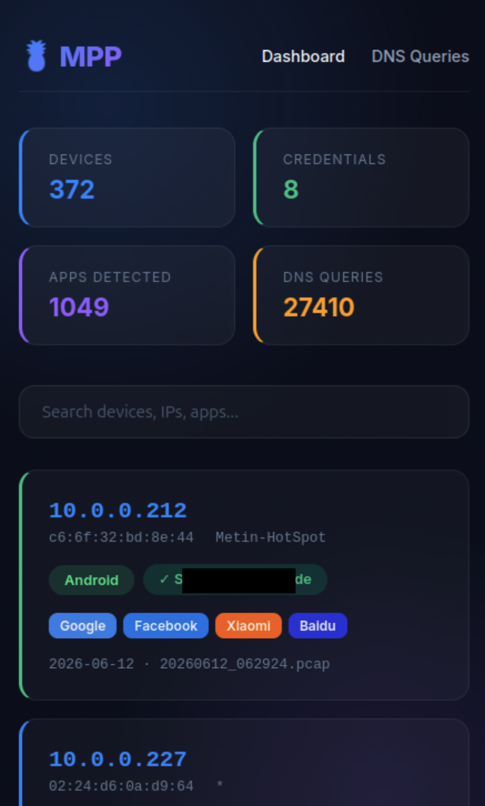
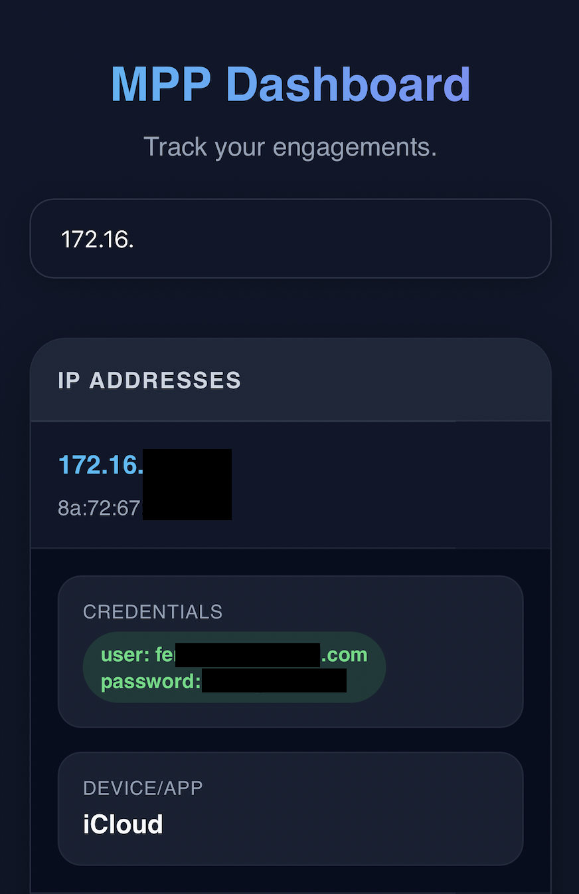
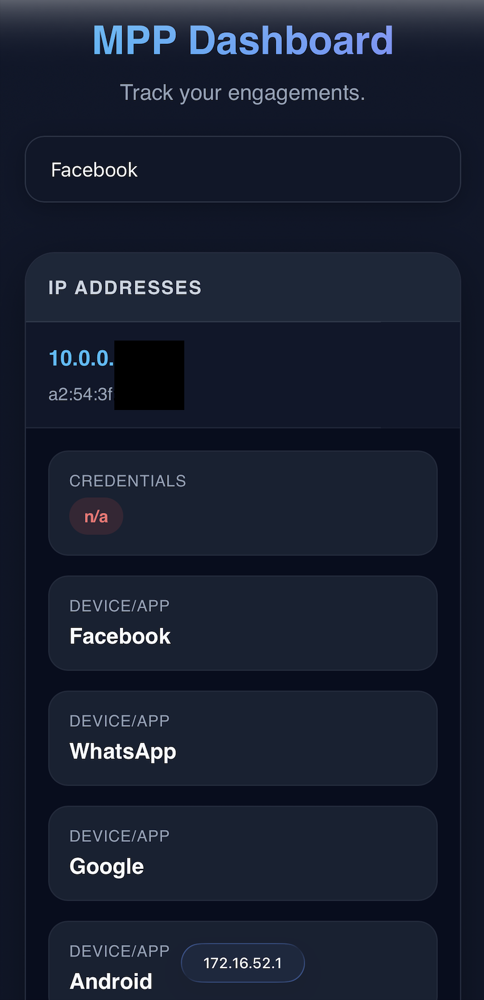

# mpp

My Pineapple Pager Payloads

## Features

| Feature | Description |  
| --------- | ------------- |  
| start_dns_tcpdump | starts `tcpdump` to capture DNS requests on the pine AP interface |
| stop_dns_tcpdump | stops `tcpdump` to capture DNS requests on the pine AP interface |
| show_dns_traffic | shows captured dns traffic in a pcap file |
| show_gathered_credentials | shows credentials which were collected by Evil Portal |
| alert_evil_portal_credentials | alerts if Evil Portal captures new credentials |
| dashboard_start | starts the dashboard for data visualization |
| dashboard_stop | stops the dashboard for data visualization |

## Installation

The module `show_dns_traffic` needs `scapy` installed to work.

1. SSH onto your pager
2. Run the following commands

```bash
opkg update
opkg install -d mmc scapy
```

3. Copy the repository into `/mmc/root/payloads/user/`
4. The module `alert_evil_portal_credentials` needs to be copied to `/root/payloads/alerts/` in the category `new client connected`.

## Dashboard

Dashboard is a module which analyzes and visualizes data collected by `Evil Portal` (`credentials.json`) and the collected `dns` dumps from the moulde `start_dns_tcpdump`.

The idea is to have a simple overview over devices which are or were connected to `Evil Portal` or the open AP. Also the modules tries to identify what apps might be installed on the device based `dns` queries the device made.

### dashboard_start

This module performs multiple steps:

- check if the database file for this module exists
- go through every pcap file `/root/loot/mpp/` and check for `dns` queries which indiciate a specific app is available on the connected mobile device
- go through the credentials entries of `Evil Portal`
- starting a web server which visualizes the identified credentials, `dns` queries and other relevant data from the `pcap` files

The module remembers which `pcap` files it already processed. So, as the start of the module takes a while it is not additionally slowed down by processing known data again.

### dashboard_stop

Kills the python web server.

### UI Preview

  

## License

Evil Portals is distributed under the GNU GENERAL PUBLIC LICENSE v3. See LICENSE for more information.

## Disclaimer

Usage of these code for attacking infrastructures without prior mutual consistency can be considered as an illegal activity. It is the final user's responsibility to obey all applicable local, state and federal laws. Authors assume no liability and are not responsible for any misuse or damage caused by this program.
